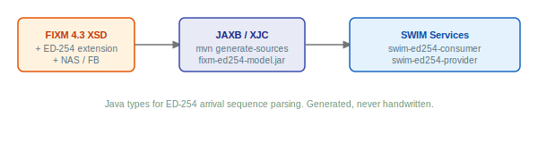

# fixm-ed254-model

Java bindings for the [FIXM 4.3](https://fixm.aero/) (Flight Information Exchange Model) and [ED-254](https://www.eurocae.net/) (Arrival Sequence Service) schemas, generated from XSD using JAXB.

ED-254 defines how ANSPs exchange arrival sequence information for Extended AMAN (E-AMAN) coordination. The schema extends FIXM 4.3 with two message types: `arrivalSequence` (real-time updates for a destination aerodrome) and `providerExceptions` (service status notifications). This module packages the official XSD schemas, the JAXB binding customization, and the generated Java classes so that downstream projects can work with ED-254 messages as a Maven dependency.



## What's inside

- **27 XSD schemas**, FIXM 4.3 core (base, flight, arrival, departure, en-route) and the ED-254 extension schema
- **1 JAXB binding file**, customization for FIXM namespace mapping
- **245 generated Java classes**, committed to the repository so that consumers don't need XJC tooling at build time
- **`Ed254UnmarshallerPool`**, a thread-safe unmarshaller pool with XSD validation and secure XML parsing
- **`Ed254XsdValidator`**, standalone XSD validation without unmarshalling

## Generated packages

| Java package | Source schema |
|-------------|--------------|
| `aero.fixm.base` | FIXM 4.3 base types: measures, organizations, ranges |
| `aero.fixm.flight` | FIXM 4.3 flight types: aircraft, arrival, departure, route, cargo |
| `aero.fixm.ed254` | ED-254 extension: arrival sequences, provider exceptions, AMAN states |
| `aero.fixm.validation` | Unmarshaller pool and XSD validator (hand-written) |

## Technology

| Component | Version |
|-----------|---------|
| FIXM | 4.3 |
| ED-254 | 1.0 |
| Jakarta XML Binding (JAXB) | 4.0.5 |
| JAXB Runtime (GlassFish) | 4.0.7 |
| Java | 21 |

---

## GET STARTED

### Prerequisites

- Java 21
- Maven 3.9+

### Install into local Maven cache

```bash
./mvnw clean install -DskipTests
```

This compiles the module and installs it into `~/.m2` so that downstream projects can resolve it.

### Add to your project

```xml
<dependency>
    <groupId>com.github.swim-developer</groupId>
    <artifactId>fixm-ed254-model</artifactId>
    <version>1.0.0-SNAPSHOT</version>
</dependency>
```

### Unmarshal ED-254 messages

```java
// Ed254UnmarshallerPool is thread-safe, create once and share across the application
var pool = new Ed254UnmarshallerPool();

// Returns ArrivalSequenceType or ProviderExceptionsType depending on the message root element
Object result = pool.unmarshalAndValidate(xmlString);
if (result instanceof ArrivalSequenceType seq) {
    // handle arrival sequence
} else if (result instanceof ProviderExceptionsType ex) {
    // handle provider exception
}

// Use Ed254XsdValidator when you only need schema validation without unmarshalling
var validator = new Ed254XsdValidator();
validator.validate(xmlString); // throws SchemaValidationException on failure
```

---

## Regenerating the classes

The generated classes are committed to the repository. Regeneration is only needed if the XSD schemas or binding file change.

```bash
./mvnw process-sources -Pgenerate-xjc
```

Running only `generate-sources` will delete the existing classes and not copy the new ones back. Always use `process-sources` or later.

The clean step only removes the XJC-generated packages (`aero/fixm/base`, `aero/fixm/ed254`, `aero/fixm/flight`). The hand-written classes in `aero/fixm/validation/` are preserved.

---

## License

Licensed under the [Apache License 2.0](LICENSE).
